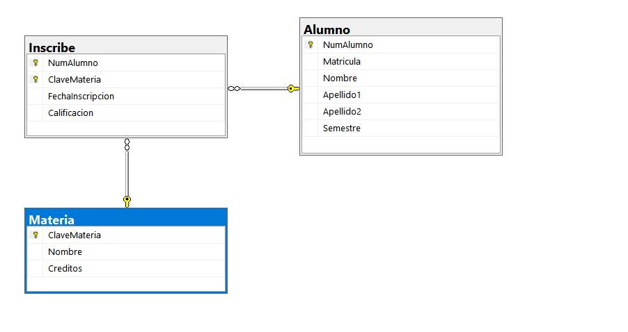

```SQL
CREATE DATABASE inscribe ;


USE inscribe;

CREATE TABLE Alumno (
    NumAlumno INT IDENTITY(1,1) NOT NULL,
    Matricula VARCHAR(20) NOT NULL,
    Nombre VARCHAR(50) NOT NULL,
    Apellido1 VARCHAR(50) NOT NULL,
    Apellido2 VARCHAR(50),
    Semestre INT,
    CONSTRAINT pk_Alumno PRIMARY KEY (NumAlumno),
    CONSTRAINT uq_Alumno_Matricula UNIQUE (Matricula)
);
GO

CREATE TABLE Materia (
    ClaveMateria INT IDENTITY(1,1) NOT NULL,
    Nombre VARCHAR(100) NOT NULL,
    Creditos INT NOT NULL,
    CONSTRAINT pk_Materia PRIMARY KEY (ClaveMateria),
    CONSTRAINT uq_Materia_Nombre UNIQUE (Nombre)
);
GO
 
 CREATE TABLE Inscribe (
    NumAlumno INT NOT NULL,
    ClaveMateria INT NOT NULL,
    FechaInscripcion DATE NOT NULL,
    Calificacion DECIMAL(4,2),
    CONSTRAINT pk_Inscribe PRIMARY KEY (NumAlumno, ClaveMateria),
    CONSTRAINT fk_Inscribe_Alumno FOREIGN KEY (NumAlumno)
        REFERENCES Alumno (NumAlumno),
    CONSTRAINT fk_Inscribe_Materia FOREIGN KEY (ClaveMateria)
        REFERENCES Materia (ClaveMateria)
);
GO


```
 